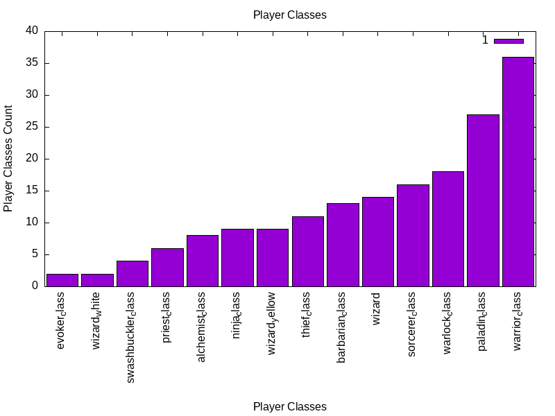
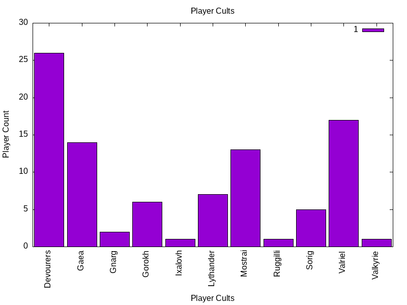
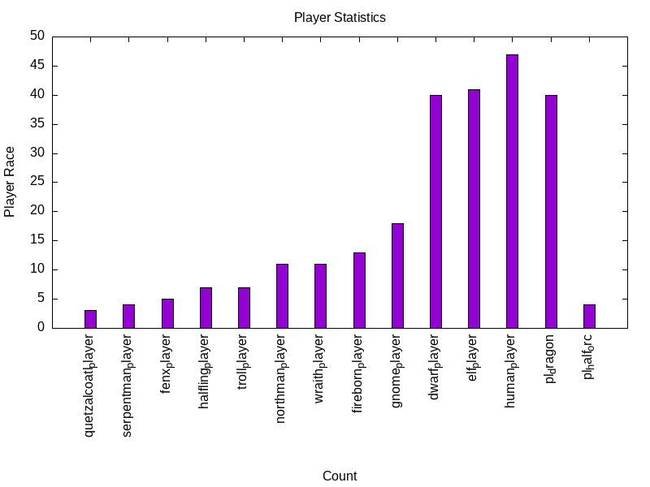

# Crossfire Server Demographics

## Description

A bash script the searches through all server player files and collects statistics on which race, cult, and class the players have chosen to play or use and then assembles a bar graph with this information.

## Installation

It is helpful to have `git` installed to download all the related code for `Crossfire Server Demographics`

### Requirements

`gnuplot` is required to generate the graphical output of the scripts.

No special add-ons or installation is required as the required tools are already bundled in most Linux distributions, such as: `grep`, `sort`, and `uniq`

## Guidelines

### Description: Questions to Consider

 * What is the script for?
   * The scripts are designed for individuals operating a Crossfire server who wish to gain insights into the choices players are making regarding cults, races, and class/professions.
 * What was your motivation?
   * My motivation for creating this script was rooted in my involvement with a gaming project centered around [Crossfire](https://sourceforge.net/projects/crossfire/). Frequently, I would encounter questions on platforms like [Discord](https://crossfire.real-time.com/discord/) and [IRC](https://crossfire.real-time.com/irc/), as well as within the game servers themselves, where people were curious about what characters and roles players were selecting. This tool aims to provide valuable information to help both players and map makers by shedding light on these choices and guiding map content creation.
 * What problem does it solve?
   * This script efficiently offers straightforward statistics and numerical data about the player base on the game server, addressing the need for a quick and reliable way to gain insights into player choices.

## Usage

Each script collects population info on a different demographic and is run individually to collect player character information.

 * `player_classes.sh` - collects number of players who are in the current in-game classes or professions of alchemist, barbarian, devotee, evoker, sorcerer, summoner, warlock, wizard, monk, ninja, priest, swashbuckler, thief, paladin, warrior, and ranger
 * `player_cults.sh` - collects number of players who are followers of the current in-games cults of Devourers, Gaea, Gnarg, Gorokh, Ixalovh, Lythander, Mostrai, Ruggilli, Sorig, Valriel, and Valkyrie
 * `player_race.sh` - collects number of players who are in the current in-game races of dragons, dwarves, elves, fendrakis, fireborn, gnome, half orc, halfling, human, northmen, quetzalcoatls, serpent folk, trolls, and wraiths

Download and save the scripts or `git pull` the scripts, make them executable using `chmod +x <script-name>.sh`, and then run it using `./<script-name>.sh`.

This script will create a CSV file with the results and generate a bar graph in PNG format named "bar_graph.png" based on the data in the CSV file.

## Screenshot

 * Sample of currently selected player classes
 
 * Sample of currently selected cults
 
 * Sample of currently selected player races
 

## Live Web Page

Not available yet, work in progress.

## Contributing

 * Contributions are welcome.
 * Pull requests are welcome.
 * Creating a fork on this code base is also welcome.

## Questions

I can be reached via [tannerrj GitHub Profile](https://github.com/tannerrj)

## License:

MIT License

## Crossfire Social Media Links

 * [Facebook](https://www.facebook.com/crossfireproject/)
 * [Mastodon](https://mastodon.social/@crossfiremrpg)
 * [X (Formerly Twitter)](https://twitter.com/crossfiremrpg/)